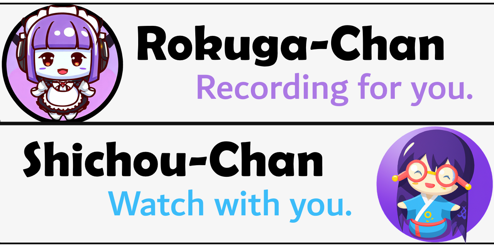

# dtv-discord-go



Discord の Bot として動作する [mirakc](https://github.com/mirakc/mirakc) による録画管理ツールです。以下の機能を持っています。

- 番組情報のDiscordへの自動投稿機能
- 投稿へのリアクションで予約する機能
- 自動的な番組検索の機能
- 自動検索での番組追加時にメンションを付ける通知機能
- 自動検索時での番組追加時に録画を行う自動録画機能
- 録画ファイル名を決める際にOpenAIのGPT3.5を用いてタイトル・サブタイトル・話数を切り出す機能
- 放送予定の番組情報の検索Web UI
- 録画済み番組の検索・視聴Web UI

機能要望や使ってみてのご意見は[Discussions](https://github.com/kounoike/dtv-discord-go/discussions)まで、明確なバグの場合は[Issues](https://github.com/kounoike/dtv-discord-go/issues)までお願いします。もちろんプルリクエストも歓迎です。

マスコットキャラクターはBing DALL-E/OpenAI DALL-Eに生成してもらいました。

## 免責事項

**本ソフトウェアを用いて予約した録画の失敗などについて開発者は一切責任を負いません。**

## 非互換バージョンアップのお知らせ

v0.6.0で自動検索メッセージの書式を`:`から`=`に変更しました。メッセージ編集などで対応してください。

v0.7.0で自動エンコード機能を追加しました。`docker-compose.yml.example`と`config.yml.example`の差分を見て必要な設定を追加してください。

v0.8.0でリアクションの意味を変更しました。以前のバージョンから続けて稼働している場合、予期せぬ挙動となる可能性があります。

## 動作環境

Docker / Docker Composeでの動作を想定しています。ホストでの実行などは想定していません。
amd64とarm64のイメージを作っているので、x86_64なマシンだけでなくRaspberry Pi(64bit OS)などで動作すると思われます（未検証）。

## セットアップ

### Tailscale サインアップ＆セットアップ

WebへのアクセスのためにはTailscaleにサインアップして、クライアントマシンにインストールしておく必要があります。Tailscaleについて詳しくは他ページを参照してください。

### Discord Application の登録と Bot tokenの取得

1. https://discord.com/developers/applications をブラウザで開きます（Discord アカウントで認証が必要です）
2. 右上の New Application ボタンを押します
3. CREATE AN APPLICATION のモーダルで NAME に好きな名前を入れます
4. 規約を読み、チェックボックスにチェックを入れます
5. Create を押します
6. 必要に応じてNAME、APP ICON、DESCRIPTIONを書き換えます
7. 左のメニューの Bot を選択し、Add Bot ボタンを押します
8. Yes, do it! ボタンを押します
9. USERNAME の下にある TOKEN の Copy ボタンを押し、コピーされた Token をメモしておきます
10. 下の方にある MESSAGE CONTENT INTENT のスイッチを選択し、青の状態にして Save Changes を押します
11. 左のメニューの OAuth2 を押し、展開されて出てきた URL Generator を選択します
12. SCOPES から bot にチェックを入れます
13. BOT PERMISSIONS のうち、以下にチェックを入れます
    - Manage Channels
    - Read Messages/View Channels
    - Send Messages
    - Send Messages in Threads
    - Manage Threads
    - Read Message History
    - Add Reactions
14. 一番下の GENERATED URL の Copy ボタンを押して URL をコピーします
15. コピーした URL をブラウザで開き、導入するサーバを選択して、はい→認証を押します

3.の手順で入れた名前、6.の手順で登録したアイコンがサーバ上でのボットの名前・アバターになります。好きな名前・アバターをお使いください。
もし良ければ以下のアイコンをお使いください（愛称募集中）。


### Docker / docker-compose のインストール

[公式ドキュメント](https://docs.docker.com/engine/install/ubuntu/)に従い Docker Engine / docker compose / docker buildx をインストールします。

このままだと `docker` コマンドを実行するのに `sudo` が必要で手間なため、普段使いのユーザを `docker` グループに所属させます。

```
$ usermod -aG docker my-user-name
```

ユーザ情報を反映させるため一度再ログインします。

### 設定

#### mirakc の設定

[できるmirakc](https://mirakc.github.io/dekiru-mirakc/latest/config/) の記載と./docker-compose/mirakc/config.yml.exampleを参考に、./docker-compose/mirakc/config.ymlを設定します。

#### docker-compose の設定

./docker-compose/docker-compose.yml.example を docker-compose.yml にコピーしてください。
./docker-compose/docker-compose.yml.example の中では録画ファイルの保存先ディレクトリを /nas/video/recorded にしています。環境に合わせて書き換えてください。

#### dtv-discord-go の設定

./docker-compose/config.yml.exampleを元にconfig.ymlを作成します。設定ファイルはYAML形式になっています。基本的に書き換える必要があるのは discord.token だけです。ここに先の手順で控えておいた Discord Bot の Token を記載します。

TBW: OpenAIのトークンの設定方法と録画ファイル名のテンプレートの書き方

### 実行

./docker-compose ディレクトリで `docker compose up -d` コマンドを実行すると起動します。マシンを再起動しても自動的に再度起動するようになっています。

続いて、`docker compose logs -f web` コマンドを実行し、webのログを確認します。

```
docker-compose-web-1  |
docker-compose-web-1  | To authenticate, visit:
docker-compose-web-1  |
docker-compose-web-1  |         https://login.tailscale.com/a/1234abcd5678
```

のようなログが出るので、ダブルクリックするなどしてこのURLをブラウザで開くと Tailscale の認証ページになります。メールアドレス・パスワードでの認証またはGoogle/Microsoft/GitHubで認証し、"Connect" ボタンを押してください。"Login Succsessful" と出たら成功です。ブラウザを閉じ、コマンドを実行したターミナルはCTRL+Cで抜けてください。


## バージョンアップ

mirakc/dtv-discord-goなどの更新は./docker-composeディレクトリで`./update.sh`としてイメージをpull＆buildして、`docker compose down && docker compose up -d`を実行します。

## 使い方

初回起動後は mirakc が EPG 情報を取得したり、取得した情報を dtv-discord-go が一気に書こうとして Discord の Rate Limit にひっかかったりするため、かなりの時間がかかります。

### 番組情報

`録画-番組情報`というカテゴリーの下にmirakcで設定されたチャンネル名を小文字・半角化した名前でチャンネルが出来ているはずです。EPG情報が取得されると番組ごとに1発言でタイトルや内容などが投稿されます。
（小文字になるのは Discord の仕様です）

### 手動録画

上記の番組ごとの発言に対して、Botが🔴(`:red_circle:`)でリアクションしています。ここに更に🔴でリアクションすると、Bot が🆗(`:ok:`)リアクションを返します。このとき裏でmirakcに対して録画スケジュール登録をしているので、時間が来ると録画されます。録画が完了すると Bot が📼(`:vhs:`)でリアクションします。

### 自動検索

`録画-通知・予約`というカテゴリーの下に`自動検索`というチャンネルが作成されています。このチャンネルに特定の形式でスレッドを投稿し、🆗(`:ok:`)でリアクションすると、その内容が自動検索機能の対象になります。投稿のタイトルは何でも構いません。本文は以下のように指定します。=の前後の空白は無視されます

例1: 「NHK」を含む名前のチャンネルでタイトルに「ニュース」をタイトルに含む番組を自動検索する

```
チャンネル = NHK
タイトル=ニュース
```

例2: 全チャンネルの「NEWS」をタイトルに含む番組を自動検索する

```
タイトル= NEWS
```

英数字は全角・半角、大文字・小文字を正規化して比較するので、区別されません。
現時点ではチャンネル名と番組タイトルしか検索できませんが、いずれ拡張したいと思っています。

EPGが更新される度にこれらのルールがチェックされ、ルールに合う番組が見つかると、そのスレッドにぶら下がる発言で見つかった番組の情報が投稿されます。

スレッドの発言に対して🔴リアクションをしても録画はされないので注意してください。発言の中にある URL が`録画-番組情報`の発言へのリンクなので、そちらのメッセージに対してリアクションするか、スレッドの最初の発言に🔴でリアクションしてください。

以下の通知・録画のためのリアクションを必要に応じて付けて（何もつけなくてもOK）から、🆗(`:ok:`)でリアクションすると自動検索が有効になります。

### 自動検索・通知

自動検索で投稿したスレッドの最初の発言に対して、👀(`:eyes:`)でリアクションしておくと、ルールに合う番組が見つかったときの投稿にリアクションした人へのメンションが付与されます。見逃したくないときに利用してください。

### 自動検索・録画

同様に🔴(`:red_circle:`)でリアクションしておくと、ルールに合う番組が見つかったときの投稿と同時に録画がスケジュールされます。

## 完了ログ

録画が開始したとき・正常に完了したときには`録画-情報`カテゴリの`録画開始・完了`チャンネルにメッセージが投稿されます。
録画に失敗したときは`録画-情報`カテゴリの`録画失敗`チャンネルにメッセージが投稿されます。

## 注意事項

現時点では番組情報投稿、自動検索はEPGの更新で追加された番組情報に対してだけ有効です。途中で書き換わった番組情報については対処していません。

録画予約について、チューナーの数を考慮していないため、チューナー数より多い数の番組を同時に録画予約した場合録画できない番組が出てきます。特に警告などもないので注意してください。

番組情報の発言、自動検索結果については現時点ではログに残り続けます。過去の番組情報について🔴リアクションをしても当然ながら録画出来ないので注意してください。特に警告などもありません。

## TODO

https://github.com/users/kounoike/projects/2/views/1 にもありますが、大きなものは以下

- チューナー不足時の処理を考える
- 過去の番組情報をどうするか考える
